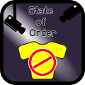
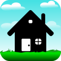
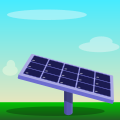
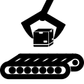
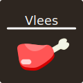
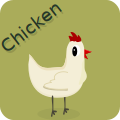

# Logoctober

Elke dag een nieuw logo

<table style="border-collapse: collapse; text-align: center;">
	<thead>
		<tr>
			<th style="padding: 8px;">Ma</th>
			<th style="padding: 8px;">Di</th>
			<th style="padding: 8px;">Wo</th>
			<th style="padding: 8px;">Do</th>
			<th style="padding: 8px;">Vr</th>
			<th style="padding: 8px;">Za</th>
			<th style="padding: 8px;">Zo</th>
		</tr>
	</thead>
	<tbody>
		<!-- Week 1: Sep 29 - Oct 5 -->
		<tr>
			<td></td><td></td><td>
				1 
				
			</td><td>
				2 
				
			</td><td>
				3 
				
			</td><td>
				4 
				
			</td><td>
				5 
				
			</td>
		</tr>
		<!-- Week 2: Oct 6 - Oct 12 -->
		<tr>
			<td>
				6 
				
			</td><td>
				7 
				
			</td><td>
				8 
				
			</td><td>
				9 
				
			</td><td>
				10 
				
			</td><td>
				11 
				
			</td><td>
				12 
				
			</td>
		</tr>
		<!-- Week 3: Oct 13 - Oct 19 -->
		<tr>
			<td>
				13 
				
			</td><td>
				14 
				
			</td><td>
				15 
				
			</td><td>
				16 
				
			</td><td>
				17 
				
			</td><td>
				18 
				
			</td><td>
				19 
				
			</td>
		</tr>
		<!-- Week 4: Oct 20 - Oct 26 -->
		<tr>
			<td>
				20 
				
			</td><td>
				21 
				
			</td><td>
				22 
				
			</td><td>
				23 
				
			</td><td>
				24 
				
			</td><td>
				25 
				
			</td><td>
				26 
				
			</td>
		</tr>
		<!-- Week 5: Oct 27 - Oct 31 -->
		<tr>
			<td>
				27 
				
			</td><td>
				28 
				
			</td><td>
				29 
				
			</td><td>
				30 
				
			</td><td>
				31 
				<!-- Add image:  -->
			</td><td></td><td></td>
		</tr>
	</tbody>
</table>

